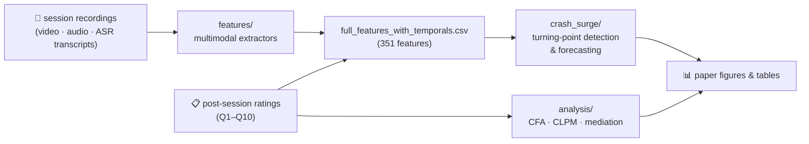

# Memory-Driven Self-Disclosure and Relational Turning Points

[](https://arxiv.org/abs/2607.14593)
[](https://doi.org/10.1145/3776574.3831135)
[](pyproject.toml)
[](LICENSE)

**What makes talking to an AI feel like a *relationship* rather than a series
of isolated chats?** We had 24 participants talk with a memory-augmented
voice agent for 10 daily sessions and rated five relational constructs after
every session — then modeled both the slow accumulation and the abrupt
turning points (*crashes* 📉 and *surges* 📈) of the relationship.

Analysis code for our **ICMI '26** paper ([preprint](https://arxiv.org/abs/2607.14593)).

## Key findings

- 🌉 **Perceived memory is a longitudinal bridge.** Session quality dominates
  in-the-moment enjoyment but doesn't carry forward; feeling *remembered*
  deepens next-session self-disclosure, which carries enjoyment forward.
- ⚡ **Turning points are asymmetric.** Surges are more detectable from
  same-session behavior; some crashes are better *forecast* from
  prior-session drift than detected in the moment.
- 🛠️ **Design implication:** adaptive agents need cross-session drift
  monitoring for crash prevention *and* in-session recognition for surge
  reinforcement.

## Pipeline at a glance



| Directory | What it does |
|---|---|
| [`features/`](features/) | Extract 351 interpretable features from text, audio, and video |
| [`analysis/`](analysis/) | Construct-level statistics: CFA, (RI-)CLPM, mediation, growth curves, robustness |
| [`crash_surge/`](crash_surge/) | Detect & forecast relational crashes/surges with LOPO evaluation |
| [`data/`](data/README.md) | Not distributed — expected layout & formats documented |

<details>
<summary><b>📂 Full file guide</b></summary>

### `features/` — multimodal feature extraction

| File | Purpose |
|---|---|
| `text.py` | GPT-based turn-level text annotation → text features |
| `semantic_judge.py` | LLM-as-judge semantic features (memory accuracy, attunement, …) |
| `audio.py` | openSMILE eGeMAPS + wav2vec valence/arousal + turn-taking |
| `opensmile_final.py` | openSMILE extraction runner |
| `preprocessing_opensmile_full.py` | Audio preprocessing / segmentation |
| `compute_delta_features.py` | Temporal / person-normalized deltas |
| `extract_face_video_features.py` | MediaPipe-based face & attention features |
| `topic_counter.py` | Topic diversity / novelty features |
| `annotation_validation.py` | LLM-vs-human annotation agreement (Cohen's κ) |

### `analysis/` — construct-level statistics

| File | Purpose |
|---|---|
| `cfa_analysis.py` | 5-factor CFA + HTMT discriminant validity |
| `riclpm_analysis.py` | Random-intercept cross-lagged panel model |
| `rerun_clpm_and_path_diagram.py` | 5×5 cross-lagged panel model + path diagram |
| `concurrent_regression_all.py` | Same-session construct regressions |
| `growth_curve_summary.py` | Within-person growth curves |
| `mediation_memory_disclosure_enjoyment.py` | Memory → Disclosure → Enjoyment mediation |
| `robustness_analyses.py` | Permutation tests, jackknife LOPO, bootstrap CIs |
| `reduced_factor_robustness.py` | Reduced-factor robustness of crash–surge asymmetry |
| `compare_annotations.py` | Self-report ↔ annotator comparison |
| `fig_mediation_diagram.py` | Mediation path figure |

### `crash_surge/` — turning-point detection & forecasting

| File | Purpose |
|---|---|
| `config.py` / `data_loader.py` / `evaluation.py` | Shared config, data loading, LOPO evaluation |
| `exp1_event_counts.py` | Crash/surge event counts per construct |
| `exp2` / `exp20` | Contagion, recovery, persistence |
| `exp7` / `exp21` / `exp22` | Systemic (multi-construct) events |
| `exp16` / `exp23` | Threshold sensitivity analyses |
| `exp26` / `exp27` / `exp29` | Paired-bootstrap significance tests |
| `exp28b_en_stp_bootstrap_correct.py` | **Primary result**: ENLR+STP detection/forecast AUPRC |
| `exp_ablation_detection.py` | Feature-set ablation |
| `figures/` | Paper figure generation |

</details>

## Expected data format

The study data itself is not public (see [below](#data-availability)), but
the pipeline runs on any comparable data arranged like this — full schemas
with examples in [`data/README.md`](data/README.md):

```
data/
├── processed_videos/<pid>/          # one directory per participant
│   ├── session_01.mp4                     # webcam recording (video + audio)
│   ├── session_01_audio_only_16k_mono.wav # extracted audio, 16 kHz mono
│   ├── session_01_transcript.tsv          # time-aligned ASR transcript
│   └── ...                                # session_02 … session_10
├── user_assessment_labels.csv      # post-session ratings: user_id, session,
│                                   #   Q1–Q10 (7-pt Likert) + 5 construct means
└── full_features_with_temporals.csv  # merged feature matrix, one row per
                                       #   (participant, session)
```

Transcripts are tab-separated (`start_time`, `end_time`, `topic`, `speaker`,
`text`) — any ASR output mapped to those fields works.

## Quick start

Uses [uv](https://docs.astral.sh/uv/) with Python 3.11:

```bash
uv sync
```

```bash
# 1️⃣  Feature extraction (recordings → feature CSVs; needs OPENAI_API_KEY for text)
uv run python features/text.py
uv run python features/audio.py
uv run python features/extract_face_video_features.py

# 2️⃣  Construct-level analyses (no API keys needed)
uv run python analysis/cfa_analysis.py
uv run python analysis/riclpm_analysis.py
uv run python analysis/robustness_analyses.py

# 3️⃣  Crash/surge experiments (JSON/CSV → crash_surge/results/)
uv run python crash_surge/exp1_event_counts.py
uv run python crash_surge/exp28b_en_stp_bootstrap_correct.py
uv run python crash_surge/exp_ablation_detection.py

# 4️⃣  Figures
uv run python crash_surge/figures/fig5_detection_auprc.py
```

LLM-based extraction reads API keys from the environment or a `.env` file:
`OPENAI_API_KEY` (`text.py`, `semantic_judge.py`) and `GEMINI_API_KEY`
(`annotation_validation.py`).

## Data availability

The underlying study data (recordings, transcripts, per-participant ratings)
comes from a human-subjects study approved by the Ethics Review Committee on
Research with Human Subjects of Waseda University and cannot be shared
publicly. De-identified derived data may be available on reasonable request:
Ryuichi Sumida — sumida.ryuichi.65m@st.kyoto-u.ac.jp.

## Citation

> Ryuichi Sumida, Mao Saeki, Masaki Eguchi, Sadahiro Yoshikawa, Koji Inoue,
> Tatsuya Kawahara, and Yoichi Matsuyama. 2026. **Memory-Driven
> Self-Disclosure and Relational Turning Points: A Longitudinal Multimodal
> Study of Human-AI Interaction.** In *ICMI '26*, October 05–09, 2026,
> Napoli, Italy. https://doi.org/10.1145/3776574.3831135

<details>
<summary>BibTeX</summary>

```bibtex
@inproceedings{sumida2026memory,
  author    = {Sumida, Ryuichi and Saeki, Mao and Eguchi, Masaki and
               Yoshikawa, Sadahiro and Inoue, Koji and Kawahara, Tatsuya and
               Matsuyama, Yoichi},
  title     = {Memory-Driven Self-Disclosure and Relational Turning Points:
               A Longitudinal Multimodal Study of Human-AI Interaction},
  booktitle = {International Conference on Multimodal Interaction (ICMI '26)},
  year      = {2026},
  publisher = {ACM},
  address   = {Napoli, Italy},
  doi       = {10.1145/3776574.3831135}
}
```

</details>

## License

Code is released under the [MIT License](LICENSE). The paper is published
under CC-BY 4.0.
